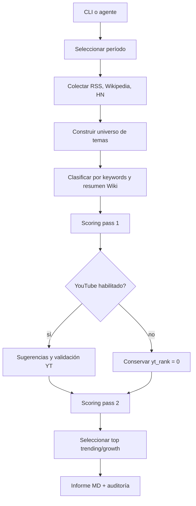
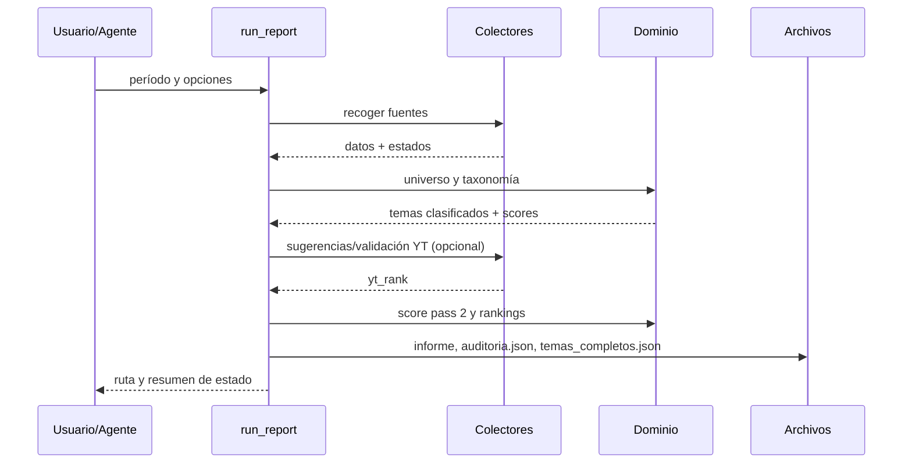

# Diseño — Agente de informes de tendencias YouTube (MVP)

## Contexto

El MVP transforma señales públicas en un informe Markdown. No hay base de
datos interna ni UI web: la CLI y el agente de opencode son adaptadores de
entrada; el dominio calcula clasificación y scores; los colectores encapsulan
I/O y la persistencia de crudos/caché está en adaptadores de archivo.

## Decisiones

1. **Composition root único:** `run_report.py` crea configuración, sesión HTTP,
   colectores y ejecuta el pipeline. Los módulos de dominio reciben datos y no
   crean sesiones globales.
2. **Períodos explícitos:** `PERIODS` en `config.yaml` y validación en CLI.
   Cada corrida trabaja con `days_current` y `days_base`.
3. **Datos compatibles con la spec:** los temas se representan como diccionarios
   con los campos del documento maestro para facilitar auditoría JSON.
4. **Fallos parciales:** cada colector devuelve datos y estado; una excepción de
   red no aborta todo el informe salvo que Wikipedia no entregue ningún día.
5. **Sin secretos:** las fuentes usan endpoints públicos y User-Agent
   configurable, pero nunca credenciales.

## Capas y componentes

| Capa | Componentes | Responsabilidad |
|---|---|---|
| Entrada | `run_report.py`, `.opencode/agent/tendencias.md` | período, flags, composición, UX |
| Aplicación | pipeline de `run_report.py` | orden exacto de fases y artefactos |
| Dominio | `classify.py`, `scoring.py` | reglas puras de clasificación/ranking |
| Adaptadores | `collectors/*`, `http.py` | HTTP, XML/JSON, backoff y crudos |
| Presentación | `report_md.py` | informe Markdown y enlaces |
| Persistencia | `data/raw`, `data/wiki_cache.json` | auditoría y caché local |

## Flujo



## Secuencia principal



## Modelo de período

```text
PeriodConfig:
  name: semana | mes | anio
  days_current: 7 | 30 | 365
  days_base: 21 | 90 | 365
```

Wikipedia se consulta desde `hoy - 2` por el retraso observado de la API. La
fecha efectiva de cada día se conserva en `dias_semana`/`dias_base`; el growth
usa promedios de días presentes, no una división fija por el tamaño ideal de la
ventana.

## Contratos internos

- Colector: `collect(...) -> (payload, SourceStatus)`; los colectores no
  escriben el informe.
- HTTP: `get_json`, `get_text`, timeout, retries y backoff; errores tipados como
  `HttpError`.
- Clasificador: `clasificar_tema(titulo, description, extract, taxonomy)`;
  devuelve un nombre de nicho o `Sin clasificar`.
- Scoring: recibe temas ya enriquecidos y devuelve los mismos temas con
  `trending_score`, `growth_score` y `score_final`.
- Reporte: recibe un contexto inmutable de corrida y devuelve Markdown.

## Calidad y pruebas

- La lógica de normalización, matching, ventanas y min-max se prueba sin red
  con `unittest` de la biblioteca estándar.
- Se cubre al menos un error de configuración/período y un error HTTP mediante
  funciones puras/fakes ligeros; no se agrega una dependencia de PBT porque el
  MVP no necesita una propiedad algebraica adicional.
- Excepción explícita al quality bar: la persistencia de JSON está en
  `run_report.py`/colectores porque el MVP no tiene una capa de almacenamiento
  compleja; se mantiene fuera de `scoring.py` y `classify.py`.

## Invariantes críticos

1. Un match de keyword no puede ser solo una coincidencia interna de otra
   palabra.
2. Un tema con `vistas_semana < 30` no entra al universo Wiki.
3. `Sin clasificar` nunca entra al ranking de nichos.
4. Un nicho con menos de 3 temas elegibles no compite.
5. Si se omite YouTube, el informe lo declara y no finge una señal positiva.

## Evolución posterior

La expansión de nichos se hará primero como `emerging_cluster`/anexo. Para
promoverlo a macronicho se requiere evidencia de 8–12 semanas, volumen,
precisión y bajo solapamiento; así se evita que la taxonomía se fragmente.
