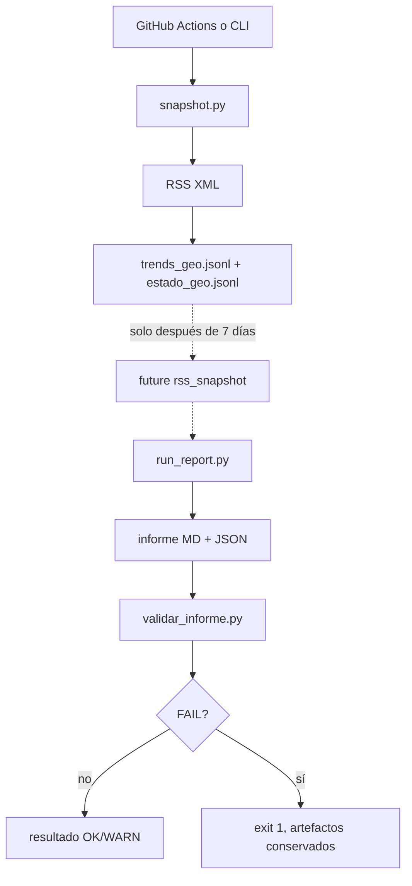

# Diseño — Mejoras MVP v2

## Decisiones

1. `snapshot.py` reutiliza el parser XML de `collectors/rss_mx.py`, pero tiene
   su propia persistencia JSONL append-only.
2. El snapshot usa `America/Mexico_City` para la fecha de negocio y UTC para la
   captura técnica.
3. La deduplicación se hace leyendo las claves existentes antes de añadir
   líneas; un relanzamiento no reescribe ni duplica datos.
4. El workflow ejecuta el módulo desde `trend-report/` y hace `git add` con la
   ruta correcta desde la raíz del repositorio.
5. El validador es stdlib-only, independiente de red y con funciones `regla_r1`
   a `regla_r8` para permitir fixtures rotas.
6. La validación ocurre después de escribir informe, auditoría y temas; el
   resultado se añade a la auditoría y un FAIL produce exit code 1.

## Flujo v2

## Snapshot

API pública: `https://trends.google.com/trending/rss?geo={geo}`. El parser
produce una lista normalizada con el primer contexto de noticia disponible.
Los XML descargados se conservan en `data/snapshots/raw/` para diagnóstico.
El dataset JSONL sí queda permitido para versionarse; los outputs de una
corrida normal continúan ignorados.

## Validador

Entrada: `--report <md>` y `--corrida <data/raw/run>`.  Carga el informe,
`auditoria.json` y `temas_completos.json`; cada regla devuelve un resultado
estructurado. Las fuentes opcionales omitidas no son FAIL. Una fuente con
ERROR visible y explicado se convierte en WARN.

R5 usa `valores_actuales` y `valores_base` conservados por el MVP para
recalcular growth con promedios diarios; no hace llamadas de red.

## Calidad

- No se añade dependencia PBT ni dependencia nueva.
- Snapshot se prueba con cliente fake y directorio temporal.
- Validador se prueba con fixture buena y ocho mutaciones rotas.
- La integración conserva el composition root y no mezcla validación con el
  dominio de scoring.
